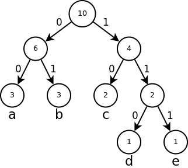
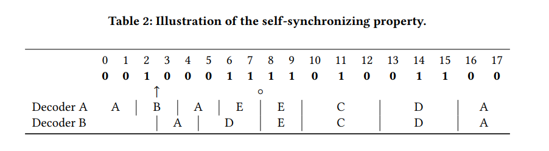
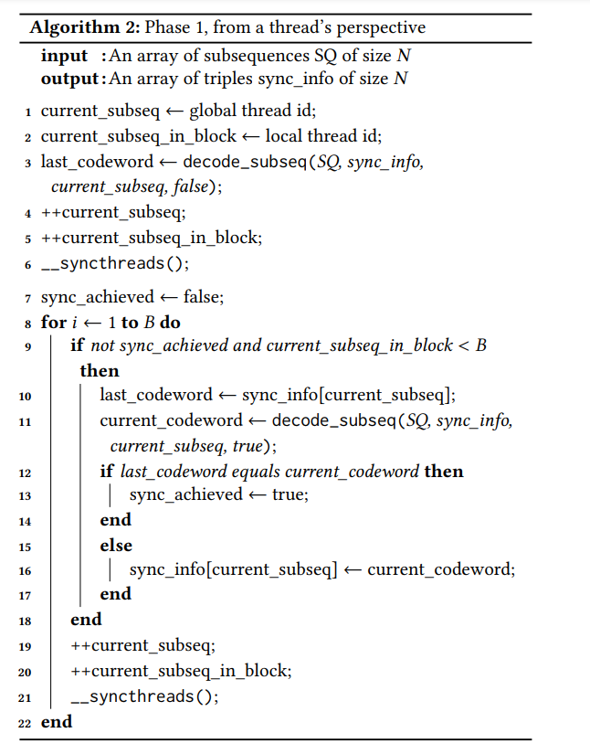

# 15618FinalProject
## Parallel GREP (Joelle Lim, Srinidhi Kaushik)

### Summary
We are going to parallelize Huffman decoding using CUDA, and if time is available, attempt to use the new gay array data structure to further enhance performance/

### Background
Data compression is a basic component of a wide range of applications, and Huffman coding is one of such lossless commpression techniques. Although the main intended purpose of compression is thought of as to save valuable storage, it plays another important role in increasing effective bandwidth to the said storage when incorporated into file systems. With the shift to data-intensive workloads and applications, the importance of being abe to conduct these compressions and decompression operations on-the-fly fast and efficiently is becoming more apparent. Hence, for this final project, we want to look into parallelizing the decoding part of this compression scheme.

The basic idea of Huffman Encoding is to assign variable legth codewords to each of the input characters, and these lengths of the assigned codes are based on the frequencies of occurence of the corresponding character in the input text. Note that none of the prefix can be repeated amongst the codewords to avoid ambiguity in decoding. To encode an input text stream, we first build a frequency dictionary, and repeatedly select 2 minimum frequency symbols and merge them using a Min Heap Tree. Finally, the codeword can be assigned to characters by recursively traversing the tree and recording the path taken by the traversal.

(Image above is taken from [here](https://bhrigu.me/post/huffman-coding-python-implementation/))
An example of this Huffman Encoding Tree is shown above. The value of a leaf node represents the frequency of occurence of the particular character in the input text; the value of an internal tree is the sum of all the values its subtree. Each branch of the tree takes on a bitcode of 0 or 1, and the code assigned to each character is the concat of all these bitcodes along the traversal path to the character node. For instance, the character a appears 3 times in the input text and is assigned a codeword 00, which has length 2; on the otherhand, the character d appears only 1 time in the input text and is hence assigned a longer codeword of 110, which has length 3.

This problem might be apt for parallelism because we are usually working with huge sized inputs for compression/ decompression. Given that we have a huffman encoding tree, the encoding and decoding stage seems to be doing the same work for each character where we translate it to and from the codewords. Hence, we believe that this decoding application that we are going to implement will benefit from parallelism.

### The Challenge
Huffman decoding has always been a challenge, and there were not many efficient parallel solutions until several experimental algorithms were proposed in the last 5 years. The reason for its difficulty lies in the fact that there is no way to tell when the encoded codeword starts and end. Huffman encoding is simple because we can break up the input into chunks and encode each chunk separately, but in the case for Huffman decoding, there is no clear separation to identify each codeword, keeping in mind that each codeword can be of different lengths.

Several state of art parallel solutions proposed to solve this issue exploit the self-synchronizing property of Huffman codes. This property is explained using the diagram below. Suppose that the two decoders, A and B, are processing the message shown in the diagram below starting from different offsets: A starts at index 0 and B starts at index 3. The first row in the diagram represents the indices of the bits in the encoded input, the second row contains the messaege itself and the last two rows contain the output from the decoders A and B. Notice that if B starts decoding at index 3, the initial decoded message is erroneous, however starting from bit 7, decoder B starts decoding the rest of the message correctly and gives the same output as A. Bit 7 is referred to as the synchronization point because both A and B decoders have become synchronous now.

Hence the idea to parallelize this problem starts from breaking the encoded input into chunks, but also making sure to incorporate the above property to synchronize the outputs from each decoder to ensure correctness. We thought that this problem is interesting because there might be several opportunities for us to experiment how we can use different synchronization primitives to actually "synchronize" the different decoders. For example, in the following pseudo code taken from the paper, the iterative technique in one of the phases might be good to implement using thread barriers. This project sounds interesting because it seems at first glance like a workload that would benefit very well from parallelism, but in fact, parallelism might be impeded because of these synchronization details. We hope to learn more about how we can synchronize these blocks better and reduce the cost of these synchronizations across the decoders from this project.

Furthermore, an improvement to this technique has also been introduced in 2020, by using a new data structure called "gap arrays". If there is time, we also intend to look into this new data structure, and we hope to learn more about how using efficient data structures can help with parallelization.

### Resources
We intend to start off by taking a look at "libhuffman" which is a single-threaded pure C library and which also has a command line interface for Huffman Coding. We plan to then modify this library to make it parallel and also implement the pseudo code algorithms described in the papers: [Massively Parallel Huffman decoding on GPUs](https://dl.acm.org/doi/pdf/10.1145/3225058.3225076) and [Huffman Coding with Gap Arrays for GPU Acceleration](https://dl.acm.org/doi/pdf/10.1145/3404397.3404429). We will be writing the paralllel version of the code in CUDA, and hence will intend to use the GHC machines to carry out our experiments.

To also test our algorithm, we found some good datasets that can be used like:
- [enwik9](http://mattmahoney.net/dc/enwik9.zip): Excerpt of the English Wikipedia, consisting of UTF8-coded XML data (raw: 1 GB, compressed 0.65 GB, ratio: 1.52).
- [flan_1565](https://sparse.tamu.edu/MM/Janna/Flan_1565.tar.gz): Sparse matrix from the SuiteSparse Matrix Collection (raw: 1.6 GB, compressed: 0.78 GB, ratio: 2.0)
- [mozilla](http://sun.aei.polsl.pl/~sdeor/index.php?page=silesia): tar-compressed archive of Mozilla 1.0 (raw: 51.2 MB, compressed 40 MB, ratio: 1.28).
- [webster](http://sun.aei.polsl.pl/~sdeor/index.php?page=silesia): 1913 Webster Unabridged Dictionary in HTML format (raw: 41.5 MB, compressed 26 MB, ratio: 1.6)

### Goals & Deliverables
##### 75%
- Finish a correct implementation of the sequential version of the Huffman Decoding.
- Finish a correct implementation of the parallel version of the Huffman Decoding.
- Run the algorithm on top of the regular GHC machiness.

##### 100%
- Evaluate the performance of the parallel version of the HUffman decoding, in terms of perhaps throughput (decompression output throughput) and identify possible bottlenecks.
- Compare the performance of the sequential/ parallel version, and also possibly against the state of art zstandard cpu version of the decompression algorithm.
- Experiment by varying the different varaibles in the algorithm like choice of the subsequence size (chunk-size), unit size, the type of data input (possibly deliberately varying the frequency or length before codewords exhibit the self sychronization properties) and seeing how they affect the end performance.

##### 125%
- Possibly test out the new gap array data structure.
- Compare the performance of the code with the gap array data structure with the normal parallel version without the gap array data structure.
- Achieve comparable performance mentioned in the papers mentioned above, and be able to replicate some of their results compared against zstandard.

### Resource & Platform Choice:
- Language/ Compiler/ Library: C/ C++, CUDA
- Platform: GHC Machines (General multi-core processors)

We choose to use CUDA so that we can have more control over the block sizes and how the workload in general is assigned to different cores. We also intend to use thread barriers and test out other synchronization primitives and CUDA gives us more flexibility to do that. In comparison, other platforms like OpenMP and OpenMPI might be too high level for us to achieve these goals.

### Schedule:
- 3/28 - 4/3: Familiarize ourselves with the algorithm. Test out the sequential version, and possibly figure out how we can obtain the huffman decoding table to use.
- 4/4 - 4/11: Implement a basic version of the parallel algorithm. Also complete the milestone report.
- 4/11 - 4/17: Continue implementation of the parallel algorithm and start the performance analysis when done. Also modify the parallel algorithm based on bottlenecks identified.
- 4/17 - 4/24: Conduct the final analysis for the possibly improved parallel algorithm and benchmark against different datasets. Write Final report.
- 4/24 - 4/28: Finish report and if time allows check out the gap array data structure.
